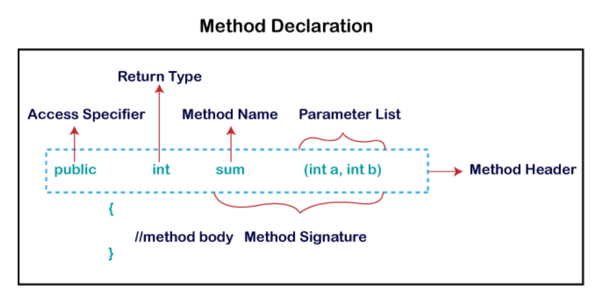

#### What is a method ?

Ans: A method is a block of code or collection of statements or a set of code grouped together to perform a certain task or operation. It is used to achieve the reusability of code. We write a method once and use it many times. We do not require to write code again and again.

#### `Method declaration`:

The method declaration provides information about method `attributes`, such as `visibility`, `return-type`, `name`, and `arguments`. It has six components that are known as `method header`.



#### `Access Modifier or Specifier`:

It specifies the visibility of the method. Java provides `four types` of access specifier.

- `Public`: This method will be accessible by all the classes when using `public` modifier.
- `Private`: When using `private` specifier then this method is accessible only in the classes not by other classes.
- `Protected`: When we use `protected` access specifier, the method is accessible within the `same package` or `subclasses in a different package`.
- `Default`: When we do not use any access specifier in the method declaration, Java uses default access specifier by default. It is visible only from the same package only.

- `Return Type`: return type is a data type which method returns. It may have a primitive data type, object, collection, void, etc. If the method does not return anything, we use void keyword.

- `Method Name:` It is a unique name that is used to define the name of a method.

- `Parameter List`: It is the `list of parameters` `separated by a comma` and enclosed in the pair of parentheses. It contains the `data type` and `variable name`. If the method has no parameter, left the parentheses blank.

- `Method Body`: It contains all the actions to be performed. It is enclosed within the pair of curly braces.

#### Types of Method

- `Predefined Method`:In Java, predefined methods are the method that is already defined in the Java class libraries is known as predefined methods also it's called as builtin methods.
  Example: length(), equals(), compareTo(), sqrt(), etc

  Each and every predefined method is defined inside a class. Such as print() method is defined in the java.io.PrintStream class.

```java
public class Demo {
    public static void main(String[] args) {
        // using the max() method of Math class
        System.out.print("The maximum number is: " + Math.max(9,7)); // The maximum number is: 9
    }
}
// in above example main, print, max are predefined methods.
```

- `User-defined Method`: The method written by the `user or programmer` is known as a user-defined method. These methods are `modified` according to the requirement.

```java
// The Scanner class is part of java.util package, and it's used to take input from the user
import java.util.Scanner;

public class EvenOdd {
    // main method
    public static void main(String[] args) {
        // creating scanner object
        Scanner scan = new Scanner(System.in);
        Helper helper = new Helper();
        // prompting the user for input
        System.out.print("Enter the number:");
        // reading input
        int num = scan.nextInt();
        // Call the method in Helper class to find if number is even or odd
        helper.findEvenOdd(num);
    }

}

// user defined method
class Helper {
    public void findEvenOdd(int num) {
        if (num % 2 == 0) {
            System.out.println(num + " is even");
        } else {
            System.out.println(num + " is odd");
        }
    }
}
```

- `static method`: A method which has static keyword is known as static method. In other words it belongs to class rather than instance of a class known as static method.

```java
public class Display {
    public static void main(String[] args) {
        show()
    }

    static void show() {
        System.out.println("Example of static method")
    }
}
```

- `instance method`: The method of the class is known as an `instance method`. It is a `non-static` method defined in the class.

```java
public class InstanceMethodExample {
    public static void main(String [] args) {
    //Creating an object of the class
    InstanceMethodExample obj = new InstanceMethodExample();
        //invoking instance method
        System.out.println("The sum is: "+obj.add(12, 13));
    }
    int s;
    //user-defined method because we have not used static keyword
    public int add(int a, int b) {
        s = a+b;
        //returning the sum
        return s;
    }
}
```

##### There are are two types of instance methods.

- `Accessor Methods (Getters)`: This method is use to read the instance variable(s) without modifying them is known as accessor method.

```java
public class Person {
    private String name;
    // Accessor Methods (Getters)
    public String getName() {
        return name;
    }
}
// Here, getName() is an accessor method that returns the value of the name variable.
```

- `Mutator Methods (Setters)`: This methos is use to modify the instance variable(s) of a class.

```java
public class Person {
    private String name;

    // Mutator method (Setter)
    public void setName(String name) {
        this.name = name;  // Modifies the instance variable
    }
}
```

#### Abstract Method

The method which does not have method body is known as abstract method.It always declared inside the abstract class. It means the class itself must be abstract if it has abstract method. To create an abstract method, we use the keyword abstract.

```java
// Abstract class
abstract class Animal {
    // Abstract method (no body)
    public abstract void sound();

    // Concrete method (with body)
    public void sleep() {
        System.out.println("This animal is sleeping");
    }
}

// Subclass that extends the abstract class and implements the abstract method
class Dog extends Animal {
    // Implementing the abstract method
    public void sound() {
        System.out.println("Dog barks");
    }
}

public class Main {
    public static void main(String[] args) {
        // Animal animal = new Animal();  // ERROR: Cannot instantiate abstract class

        Dog dog = new Dog();  // Creating a Dog object
        dog.sound();  // Outputs: Dog barks
        dog.sleep();  // Outputs: This animal is sleeping
    }
}

```

#### Factory method....... NEED TO UNDERSTAND
